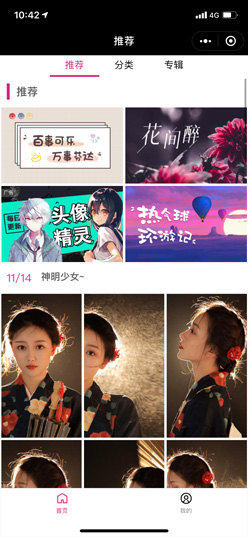
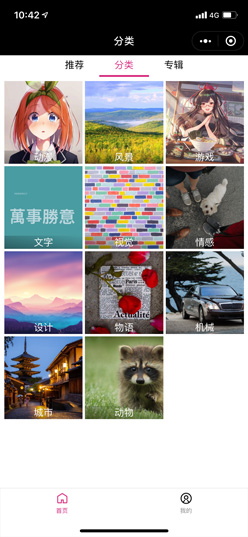
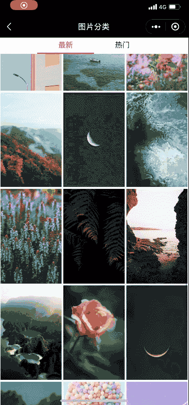
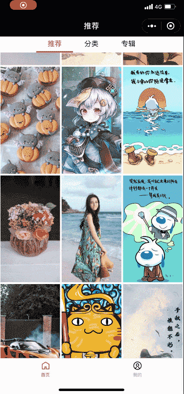
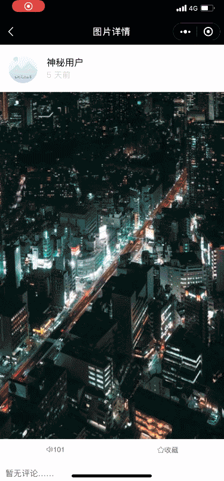
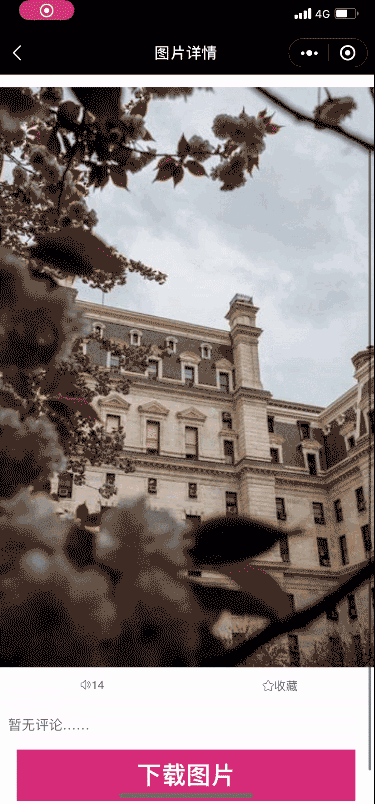
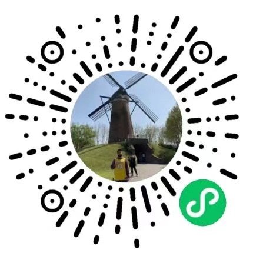

# Chris Wallpaper 壁纸推荐微信小程序

## 前言

现公司没有微信小程序相关的业务 ，所以自己想通过项目实践更好的学习小程序相关内容，通过搜索发现 **uni-app** 的语法与 **Vue** 类似，和现公司项目主要技术栈一样，比较容易上手，官网介绍能更好的移植到百度、支付宝等其他小程序，于是决定开始使用 uni-app 开发。

## 项目简介

本项目通过瀑布流的模式展示分类壁纸，目前主要实现的模块包括 **推荐、热门、分类、专辑** 等，主要功能包括 **图片评论列表、手势滑动切换图片、下载图片** 等，并且 **封装了手势滑动组件**

- 推荐
  

- 分类
  

- 专辑
  

- 瀑布流图片展示
  

- 图片评论
  

- 手势滑动组件
  

- 下载图片
  

## 项目演示

微信小程序搜索 “Chris Wallpaper” 或扫描下方小程序码可以体验



## 项目运行

- 由于涉及 ES 6/7 等新属性，node 需要 6.0 以上版本
- 需要安装 sass

```bash
git clone https://github.com/liucrystal24/mp-pic

cd mp-pic

npm install

npm run dev:mp-weixin
```

## 技术栈

**@vue/cli + uni-app + ES 6 + Scss + flex**

## 项目结构

#### src :

```tree
│  babel.config.js
│  package-lock.json
│  package.json
│  postcss.config.js
│  tsconfig.json
│  yarn.lock
│
├─dist
├─public
│      index.html
│
└─src
    │  App.vue
    │  main.js
    │  manifest.json
    │  pages.json
    │  uni.css
    │  uni.min.css
    │  uni.scss
    │
    ├─components
    │      category.vue
    │      comments.vue
    │      goDetail.vue
    │      touchmove.vue
    │
    ├─pages
    │  ├─album
    │  │      index.vue
    │  │
    │  ├─home
    │  │  │  index.vue
    │  │  │
    │  │  ├─home-album
    │  │  │      index.vue
    │  │  │
    │  │  ├─home-category
    │  │  │      index.vue
    │  │  │
    │  │  └─home-recommend
    │  │          index.vue
    │  │
    │  ├─imgCategory
    │  │      index.vue
    │  │
    │  ├─imgDetail
    │  │      index.vue
    │  │
    │  └─mine
    │       index.vue
    │
    │
    ├─static
    │  │
    │  ├─mine
    │  │      chris_avator.jpg
    │  │      email.png
    │  │      github.jpg
    │  │      phone.png
    │  │      wechat.png
    │  │
    │  └─tabbar
    │          home.png
    │          home_selected.png
    │          user.png
    │          user_selected.png
    │
    ├─style
    │      base.wxss
    │      iconfont.wxss
    │      mine.wxss
    │
    └─utils
            request.js

```

## 目标功能

- [x] 首页
  - [x] 推荐、分类、热门、专辑
  - [x] 瀑布流滑动展示
  - [x] 左右滑动图片详情切换（封装）
  - [x] 下载图片
  - [x] 照片评论列表
  - [ ] 收藏
  - [ ] 点赞
- [ ] 视频
- [ ] 搜索
- [x] 我的
  - [x] 个人信息

## 总结

1. [小程序初始化和基本知识]()
